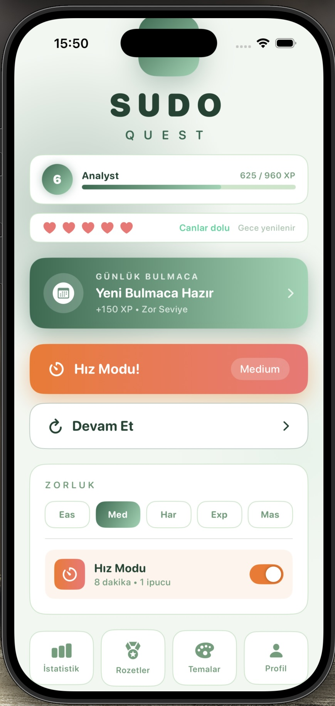

<div align="center">


<br/>
<br/>

```
 ███████╗██╗   ██╗██████╗  ██████╗      ██████╗ ██╗   ██╗███████╗███████╗████████╗
 ██╔════╝██║   ██║██╔══██╗██╔═══██╗    ██╔═══██╗██║   ██║██╔════╝██╔════╝╚══██╔══╝
 ███████╗██║   ██║██║  ██║██║   ██║    ██║   ██║██║   ██║█████╗  ███████╗   ██║   
 ╚════██║██║   ██║██║  ██║██║   ██║    ██║▄▄ ██║██║   ██║██╔══╝  ╚════██║   ██║   
 ███████║╚██████╔╝██████╔╝╚██████╔╝    ╚██████╔╝╚██████╔╝███████╗███████║   ██║   
 ╚══════╝ ╚═════╝ ╚═════╝  ╚═════╝      ╚══▀▀═╝  ╚═════╝ ╚══════╝╚══════╝   ╚═╝   
```

### *Sudoku. Reimagined as a quest.*

</div>

---

## 🎯 About

**SudoQuest** is a premium Sudoku experience for iOS that transforms classic number puzzles into a full-featured progression journey. Earn XP, unlock themes, collect badges, challenge friends — and prove yourself as a **Grandmaster**.

Built entirely with **SwiftUI** and **Combine**, it's a showcase of clean iOS architecture and polished UI design.

---

## ✨ Features

### 🧠 Core Gameplay
- **5 difficulty levels** — Easy, Medium, Hard, Expert, Master
- **Time Attack mode** — race against the clock for bonus XP
- **Smart hint system** — nudges without spoiling the fun
- **Error tracking** — optional mistake highlighting
- Custom Sudoku engine with a **backtracking solver & generator**

### 🏆 Progression System
- **20 unique player ranks** — from *Novice* all the way to *Grandmaster*
- XP rewards scaled by difficulty, time, and clean play
- **Lives system** — limited attempts add strategic tension
- Badge & achievement collection

### 📅 Daily Challenge
- New puzzle every day, same grid for all players
- Daily **streak tracker**
- Score and time leaderboards

### 👥 Social
- **Friend Challenge** — share puzzles directly with friends
- **Game Center** integration — global leaderboards & achievements

### 🎨 Themes
- **20 unlockable visual themes** — Forest, Midnight, Ocean, Sakura, Legend and more
- Themes unlock as you level up — a reward for mastery
- Full dark/light adaptive color system

### 📊 Stats & Profile
- Detailed performance charts over time
- Per-difficulty personal bests
- Full game history and win streaks

### ⚙️ Polish
- Haptic feedback
- Custom sound system with toggle
- Push notifications for daily reminders
- Full accessibility support

---

## 🏗️ Architecture

```
SudoQuest/
├── App/
│   └── SudoQuestApp.swift          # Entry point
├── Core/
│   ├── Engine/
│   │   └── SudokuEngine.swift      # Puzzle generator & validator
│   └── Managers/
│       ├── LivesManager.swift
│       ├── SoundManager.swift
│       ├── HapticManager.swift
│       ├── NotificationManager.swift
│       ├── GameCenterManager.swift
│       └── SettingsManager.swift
├── Features/
│   ├── Home/                       # Main menu & difficulty picker
│   ├── Game/                       # Game board, pause, completion
│   ├── DailyChallenge/             # Daily puzzle & friend challenges
│   ├── XP/                         # Level system & badges
│   ├── Themes/                     # Theme manager & selection UI
│   ├── Stats/                      # Performance charts
│   ├── Profile/                    # Player profile
│   ├── Settings/                   # App preferences
│   └── Tutorial/                   # Onboarding flow
├── Navigation/
│   └── ContentView.swift           # Root navigation
└── Shared/
    └── Components/                 # Reusable UI components
```

**Key patterns used:**
- `ObservableObject` + `@Published` for reactive state
- `Combine` for event-driven logic
- Protocol-oriented design on managers
- Feature-based folder structure

---

## 🛠️ Tech Stack

| Layer | Technology |
|---|---|
| Language | Swift 5.9 |
| UI Framework | SwiftUI |
| Reactive | Combine |
| Game Services | Game Center |
| Storage | UserDefaults + Codable |
| Notifications | UNUserNotificationCenter |
| Platform | iOS 16+ |

---

## 📸 Screenshots

<div align="center">

</div>

---

## 🚀 Getting Started

```bash
git clone https://github.com/altinelynsmr/SudoQuest.git
cd SudoQuest
open SudoQuest.xcodeproj
```

> Requires Xcode 15+ and iOS 16.0+ deployment target.  
> No external dependencies — pure Swift & Apple frameworks.

---

## 🗺️ Roadmap

- [ ] App Store launch
- [ ] iPad support
- [ ] iCloud sync across devices
- [ ] Multiplayer head-to-head mode
- [ ] Android / Kotlin version

---

## 👨‍💻 Developer

**Yunus Emre Altinel**  
iOS Developer

[](https://github.com/altinelynsmr)

---

## 📄 License

This repository contains a **partial showcase** of the SudoQuest codebase for portfolio purposes.  
Full source is proprietary. All rights reserved © 2026 Yunus Emre Altinel.

---

<div align="center">
  <sub>Built with ♥ in Swift · Designed for puzzle lovers</sub>
</div>
